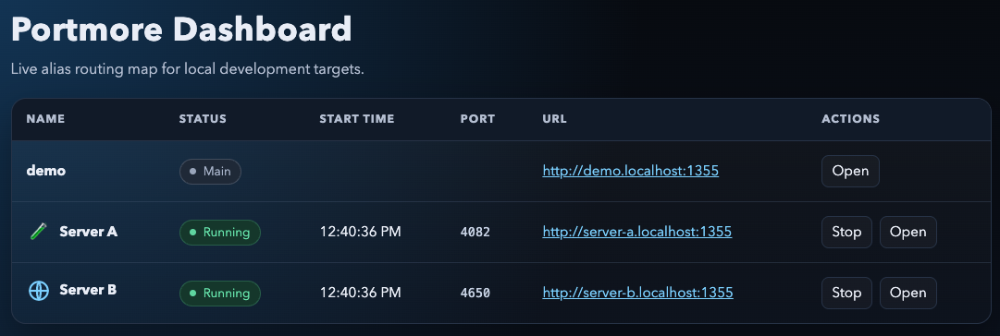

# portmore

Local multi-service helper with automatic free ports, `portless` aliases, and a small dashboard.

> Disclaimer: Primarily coded by Codex, worktree/branch naming not supported, https not tested.

## Requirements

- Node.js 22+
- [`portless`](https://github.com/vercel-labs/portless) installed and available in `PATH`

## Install

```bash
npm install portmore
```

## Quick usage

```ts
import { createServer } from "node:http";
import { portmore } from "portmore";

await portmore({
  name: "server-a",
  title: "Server A",
  metrics: async () => ({ visits: 42 }),
  start: async (port) => {
    const server = createServer((_, res) => {
      res.statusCode = 200;
      res.end("Server A\n");
    });

    return server.listen(port);
  },
  stop: async (server) => {
    await new Promise<void>((resolve, reject) => {
      server.close((err) => {
        if (err) {
          reject(err);
          return;
        }
        resolve();
      });
    });
  },
});
```

## Dashboard


